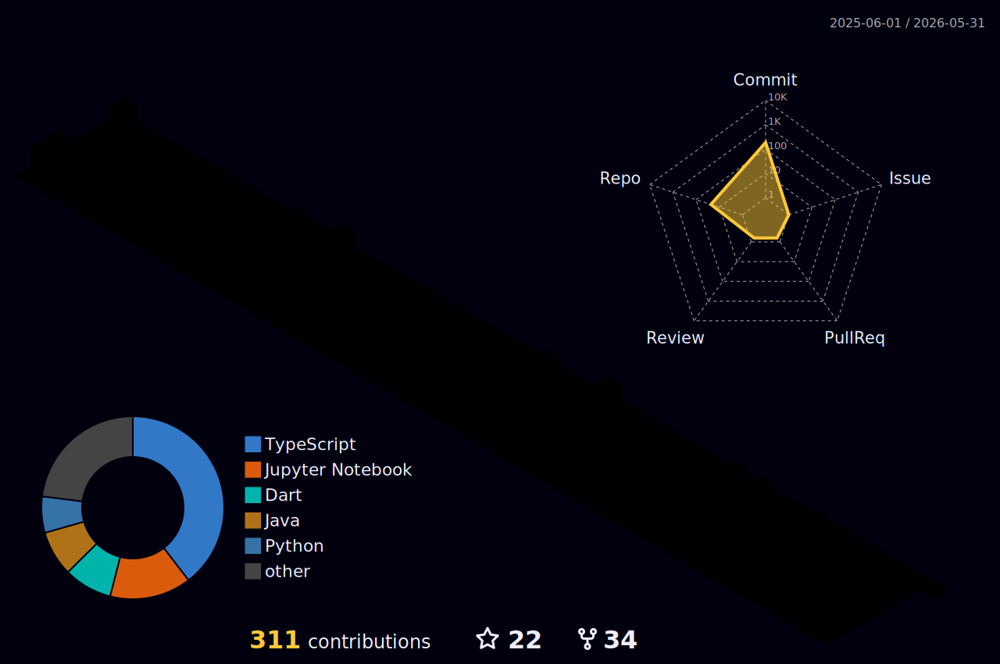

<h1 align="center">Hi 👋, I'm Shinjan Saha</h1>
<h3 align="center">A Passionate engineer interested in creating Websites, IOT projects, Apps & Games</h3>

  

  <a href="https://shinjan-portfolio-new.vercel.app">🌐 Get a glance about me</a>

➡️ Currently Learning Cybersec & AIML

---

<h3 align="center">Connect with me:</h3>

  
  
  

---

<h3 align="center">🛠️ Languages and Tools</h3>

<h4 align="center">📱 Mobile App</h4>

| Flutter | Dart | C# | Unity | Firebase |
|:---:|:---:|:---:|:---:|:---:|
|  |  |  |  |  |

<h4 align="center">🌐 Web</h4>

| HTML5 | CSS3 | JavaScript | TypeScript | React | Next.js | Tailwind | Sass |
|:---:|:---:|:---:|:---:|:---:|:---:|:---:|:---:|
|  |  |  |  |  |  |  |  |

<h4 align="center">🔌 Embedded & IoT</h4>

| Arduino | Embedded C | C | C++ | Raspberry Pi | MATLAB | Nordic nRF |
|:---:|:---:|:---:|:---:|:---:|:---:|:---:|
|  |  |  |  |  |  |  |

<h4 align="center">⚙️ Backend</h4>

| Java | Python | Node.js | Go | MySQL | MongoDB | Git | Docker |
|:---:|:---:|:---:|:---:|:---:|:---:|:---:|:---:|
|  |  |  |  |  |  |  |  |

<h4 align="center">☁️ Cloud</h4>

| AWS | Google Cloud | Firebase |
|:---:|:---:|:---:|
|  |  |  |

---

## 💻 My Workspace

### Previous Setup
- **Operating System**: Windows 11
- **Environment**: Kali Linux (virtual machine or dual boot)

### Updated Setup
- **Operating System**: macOS Ventura 13.5 (M1 Chip, 8GB RAM)

---

## 🏆 GitHub Trophies

  

---

## Hacktoberfest '23

  

---

### LeetCode Stats

  

---

## 📈 GitHub Stats

  

  

  

  

---

