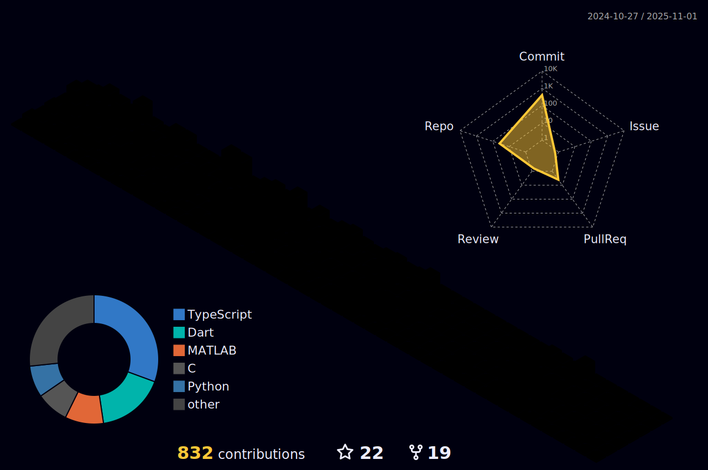

<h1 align="center">Hi 👋, I'm Shinjan saha</h1>
<h3 align="center">A Passionate engineer interested in creating Websites,IOT projects, Apps & Games</h3>

 
 [Get a glance about me](http://shinjansaha02.me/)

  ➡️Currently Learning Cyberspec & AIML  

<h3 align="left">Connect with me:</h3>

<h3 align="left">Languages and Tools:</h3>

                      
             
             
   
          

            
            
          
           

## 💻 My workspace

## Previous Setup
- **Operating System**: Windows 11
- **Environment**: Kali Linux (virtual machine or dual boot)

## Updated Setup
- **Operating System**: macOS Ventura 13.5 (M1 Chip, 8GB RAM)
## 🏆 GitHub Trophies

<!-- 
  -->

##  Hacktoberfest'23:-

### LeetCode Stats :

<a href="https://leetcode.com/Shinjan_Saha-2004/">

## &#x1f4c8; GitHub Stats

 
 
 

<!-- 

 
  
  -->
 

   <a href="https://github.com/shinjan-saha">
   

   </a>
   <a href="https://github.com/shinjan-saha">
   
    
   </a>

 

### 🔝 Top Contributed Repo

 

 

<!-- 
            
   

 -->

